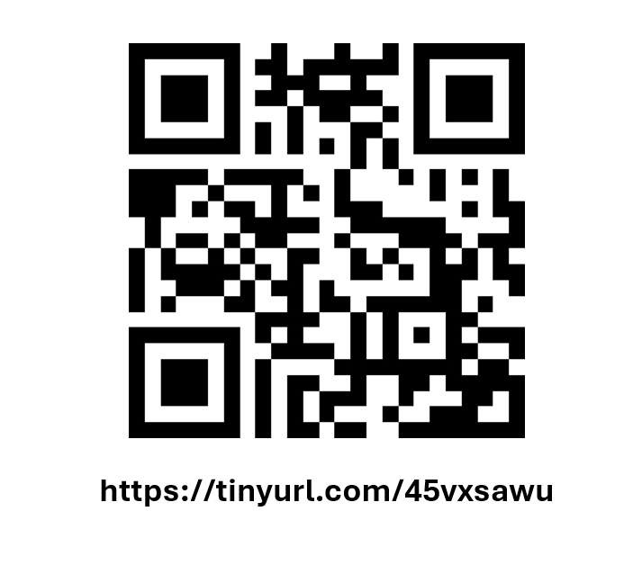

# Introduction  

 In this session, we are going to learn some basics about cleaning data in R.
The folder for this session is available at [https://tinyurl.com/45vxsawu](https://tinyurl.com/45vxsawu).  
 

For this session you will need:   

* FileA_RMarkdown_uOttawabiblio.rmd 
+ *This is the same notebook that I will be showing with the code removed*
     + *It's not necessary for you to use this file, you can also do it in a completely new notebook or R script* 
  * data/
     + SciHub_SampleData.csv  
     + SciHubDOI.csv  
 
 There are other files  
  
 * FileB_MarkDown_uOttawabiblio.rmd  
   + *this is the same file as above, but with the code already there*   
 * FileB_MarkDown_uOttawabiblio.nb.html 
   + *this is this the html file of the completed notebook*  
 * notebook_images/ 
   + *this is just the images that are in the notebook* 
 
 
 But first we are going to have a general orientation about R Studio. If you are going through this at a later date, you can watch [this](https://www.youtube.com/watch?v=FIrsOBy5k58) video. 
